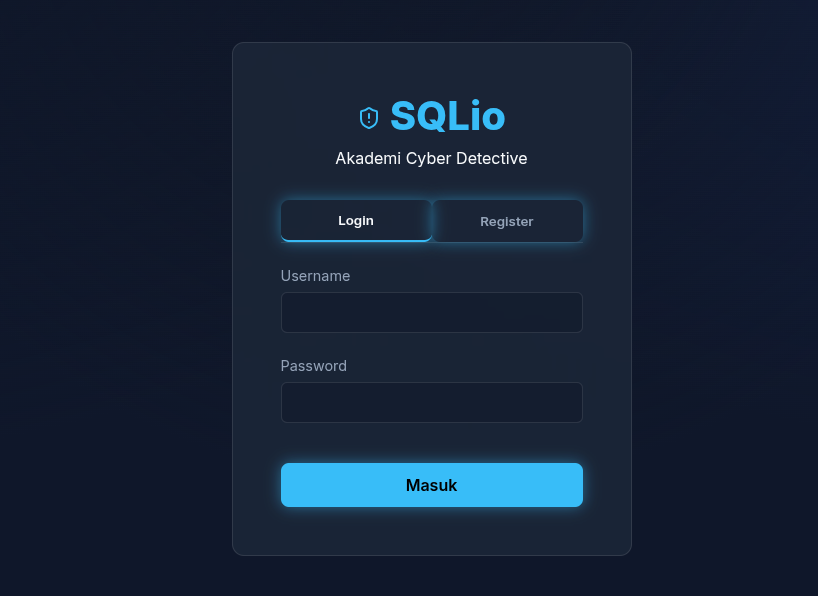
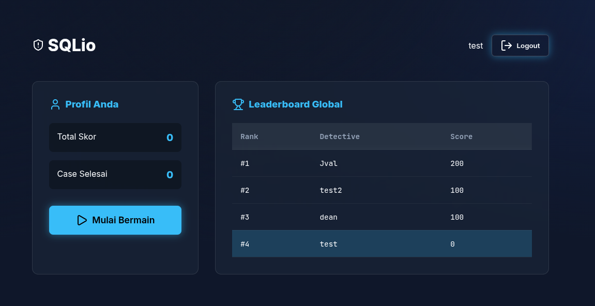
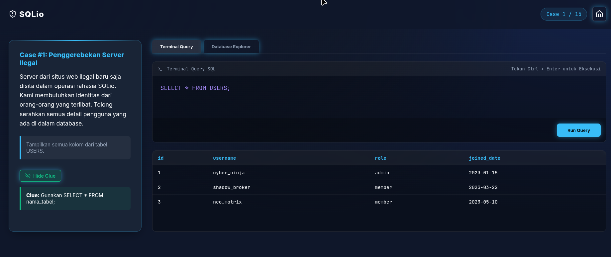

# Sqlio 🚀

Sqlio adalah aplikasi web *full-stack* untuk mengelola database SQL (SQLite). Dibuat dengan backend Node.js/Express dan frontend Vanilla JavaScript, serta berjalan sepenuhnya di dalam Docker.

## 🌟 Fitur Utama
- **UI Interaktif:** HTML, CSS, & Vanilla JS.
- **API Tangguh:** Node.js, Express & SQLite3.
- **Praktis:** Menggunakan Docker & Docker Compose.

## 🚀 Cara Menjalankan

1. **Clone repository ini:**
   ```bash
   git clone <repository-url>
   cd Sqlio
   ```

2. **Jalankan dengan Docker:**
   ```bash
   docker-compose up -d --build
   ```

3. **Akses Aplikasi:**
   - **Frontend:** `http://localhost:60005`
   - **Backend:** `http://localhost:60006`

## 📸 Screenshots

**Halaman Login**


**Dashboard Utama**


**Halaman Game/Kasus**

